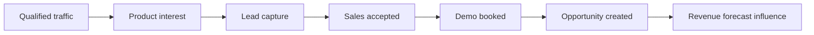
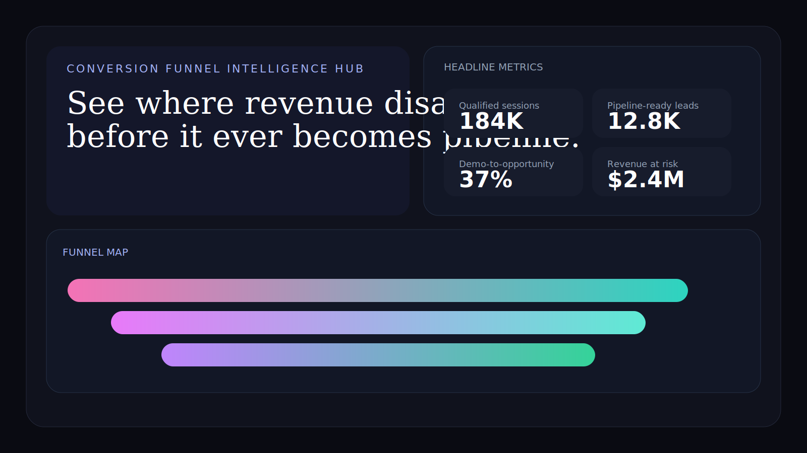
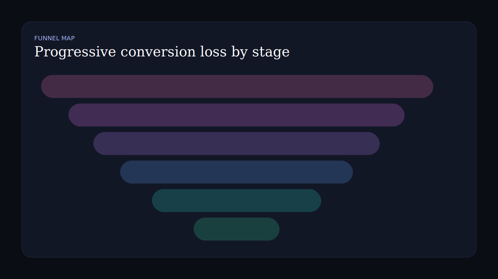
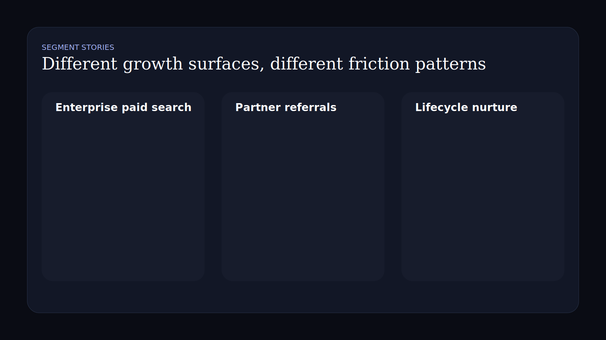
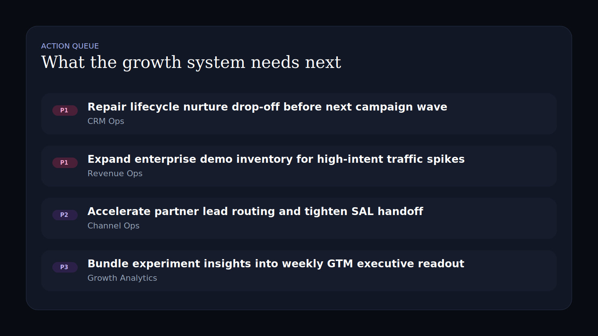

# Conversion Funnel Intelligence Hub

Editorial-style React + TypeScript workspace for conversion leakage, channel-by-channel drop-off, funnel diagnostics, and GTM action prioritization.

## Recruiter Takeaway

This project is designed to look and think less like a standard dashboard and more like a premium executive analysis surface. It demonstrates stronger visual direction, better hierarchy, and more narrative charting than a typical internal reporting tool.

## Tech Stack

[](https://react.dev/)
[](https://vite.dev/)
[](https://www.typescriptlang.org/)
[](https://developer.mozilla.org/en-US/docs/Web/CSS)
[](https://vitest.dev/)
[](https://opensource.org/license/mit)

## Overview

| Area | What it covers |
| --- | --- |
| Funnel map | Progressive conversion from session quality to opportunity creation |
| Diagnostics | Abandonment, routing pressure, calendar friction, attribution confidence |
| Segment stories | Different conversion realities by acquisition surface |
| Experiment layer | What is changing the funnel right now |
| Action queue | The GTM and growth interventions that matter next |

## Business Problem

Most funnel reporting compresses everything into one conversion rate and leaves operators guessing where the revenue risk actually sits.

This project reframes funnel intelligence as a decision surface:

- expose where conversion breaks are concentrated
- distinguish healthy segments from structurally weak ones
- connect experiment work to real funnel movement
- give GTM operators a clearer action queue

## Architecture



## What This Demonstrates

- Stronger frontend composition than a repeated panel grid
- Editorial layout choices for more persuasive data storytelling
- Visual funnel design instead of default chart-library dependence
- Conversion analysis framed as operational decision support

## Screenshots

### Hero Capture



### Funnel Map



### Segment Stories



### Action Queue



## Local Run

```powershell
Set-Location "C:\Users\chaus\dev\repos\conversion-funnel-intelligence-hub"
npm install
npm test
npm run build
npm run dev
```

## Portfolio Links

- [Kinetic Gain](https://kineticgain.com/)
- [Skills / Portfolio](https://mizcausevic.com/skills/)
- [LinkedIn](https://www.linkedin.com/in/mirzacausevic)
- [Medium](https://medium.com/@mizcausevic)
- [GitHub](https://github.com/mizcausevic-dev)
