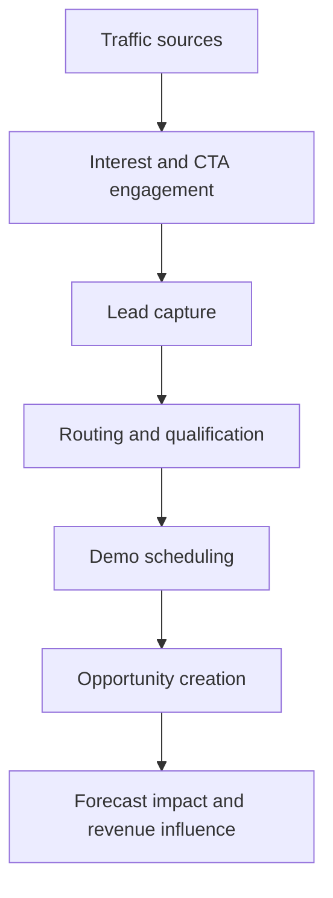

# Architecture Notes

## Product Intent

Conversion Funnel Intelligence Hub is a narrative analytics surface, not just a KPI console. The layout is meant to communicate how revenue risk propagates through the funnel in a more memorable and executive-friendly way.

## Workflow View

## Interface Blocks

- **Hero narrative**: frames the business urgency around leakage.
- **Headline metrics**: sets the executive summary layer.
- **Funnel map**: visualizes progressive conversion loss.
- **Diagnostics**: quantifies friction points with operator language.
- **Segment stories**: turns channel performance into readable narratives.
- **Experiment layer**: connects product changes to funnel movement.
- **Action queue**: converts insights into explicit next steps.
